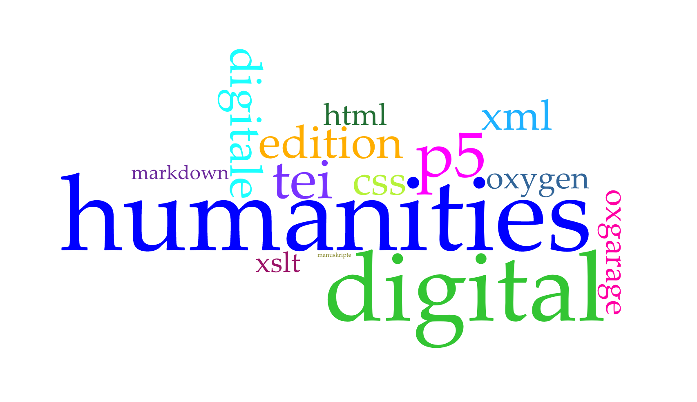
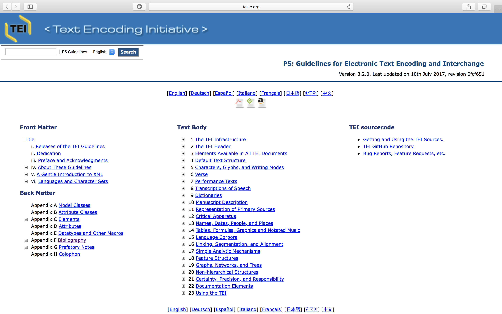
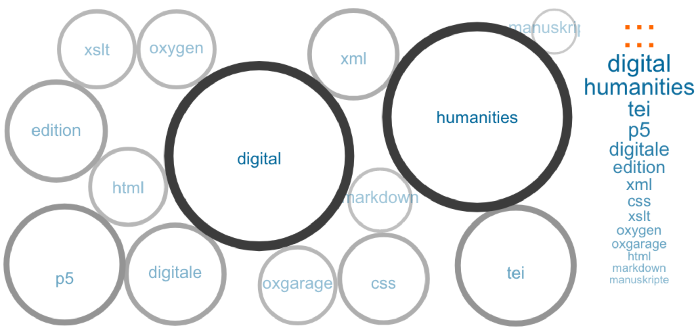

# Startseite: Digital Humanities Praktikum am OIB

---

# Recherche

Nachfolgend werden die Ergebnisse einer Recherche aufgelistet. Sie bieten einen Überblick über das Thema Digitale Edition, wichtige Institutionen, Lehrstühle, Blogs, Veranstaltungen etc.

Des weiteren wird der technische Stand am OIB und die benötigten Voraussetzungen beleuchtet, sowie die von Außen gestellten Rahmenbedingungen wie beispielsweise von der DFG.

*Erstellt mit Voyant Tools*

## 1. Digitale Edition
Hier finden sich die Rechercheergebnisse zum Thema Digitale Edition.

Das Dokument bietet einen Überblick über die wichtigsten Positionen, Argumente und der Literatur zum Thema Digitale Editionen.

&#8627; **Link zu [Digitale Edition](digitale_edition)**

## 2. Wichtige Institutionen etc. in den DH
Eine Zusammenfassung über die wichtigsten Institutionen, Lehrstühle, Zeitschriften, Blog und Veranstaltungen in den DH kann diesem Link entnommen werden.

&#8627; **Link zu [wichtige Institutionen, Lehrstühle, Zeitschriften, Blog und Veranstaltungen in den DH](institutionen_lehrstuhl_DH)**

## 3. Stand am OIB
Dieser Link führt zum aktuellen Stand der Dinge am OIB und die benötigten technischen Voraussetzungen.

&#8627; **Link zum [Stand der Dinge am OIB](stand_oib)**

## 4. Rahmenbedingungen
Einen guten Überblick zu allgemeinen Rahmenbedingungen findet sich hier.

&#8627; **Link zur [Übersicht der Rahmenbedingungen](rahmenbedingungen)**

# Dokumentation

Nachfolgend finden sich die Dokumentationen zu den verschiedenen Arbeitsschritten des Workflows für die Generierung einer TEI-P5 XML Datei.

*Link zu den allgemeinen [TEI-P5 Guidelines](http://www.tei-c.org/release/doc/tei-p5-doc/en/html/)*

## 1. Auszeichnung in TEI

TEI bietet eine Auswahl an Möglichkeiten Text auszuzeichnen. Zur Orientierung und für eine standardkonforme Auszeichnung Siehe die folgende Auszeichnungsdokumentation für TEI.

&#8627; **Link zur [Auszeichnungsdokumentation für TEI](Auszeichnung-in-TEI)**

## 2. Transformation in TEI-P5 XML

Um geeignetes Werkzeug für die Transformation zu finden wurden 4 Tools getestet. Die Dokumentation dazu findet sich hier.

&#8627; **Link zur [Transformation von .docx zu TEI-P5](transformation_docxToTei)**

## 3. Schemata
Die Ergebnisse der Recherche zu geeigneten Schemata finden sich hier.

&#8627; **Link zu [Schemata](recherche_schemata)**

# Präsentation

In einer Präsentation am 11.12.2017 wurde der aktuelle Stande des Projektes zusammengefasst vorgestellt.

&#8627; **Link zur [Präsentation]()**

*Erstellt mit Voyant Tools*